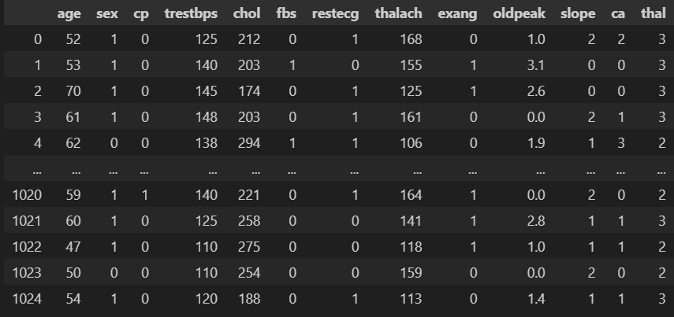
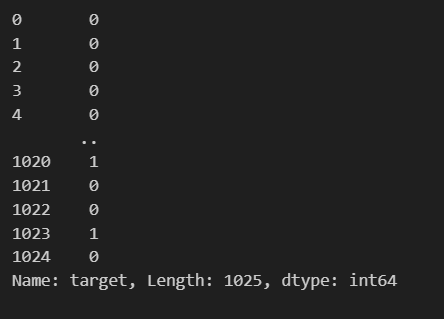
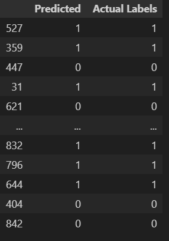
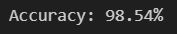
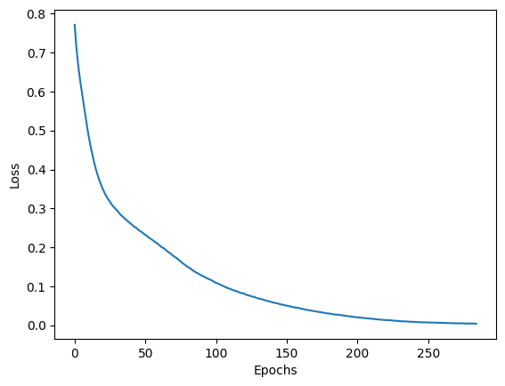
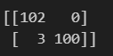
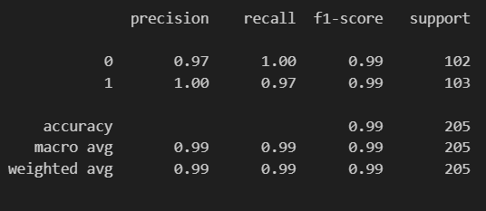

<H3>SHRI SAI ARAVIND. R</H3>
<H3>212223040197</H3>
<H3>EX. NO.6</H3>
<H3>DATE:</H3>
<H1 ALIGN =CENTER>Heart attack prediction using MLP</H1>
<H3>Aim:</H3>  To construct a  Multi-Layer Perceptron to predict heart attack using Python
<H3>Algorithm:</H3>
Step 1:Import the required libraries: numpy, pandas, MLPClassifier, train_test_split, StandardScaler, accuracy_score, and matplotlib.pyplot.<BR>
Step 2:Load the heart disease dataset from a file using pd.read_csv().<BR>
Step 3:Separate the features and labels from the dataset using data.iloc values for features (X) and data.iloc[:, -1].values for labels (y).<BR>
Step 4:Split the dataset into training and testing sets using train_test_split().<BR>
Step 5:Normalize the feature data using StandardScaler() to scale the features to have zero mean and unit variance.<BR>
Step 6:Create an MLPClassifier model with desired architecture and hyperparameters, such as hidden_layer_sizes, max_iter, and random_state.<BR>
Step 7:Train the MLP model on the training data using mlp.fit(X_train, y_train). The model adjusts its weights and biases iteratively to minimize the training loss.<BR>
Step 8:Make predictions on the testing set using mlp.predict(X_test).<BR>
Step 9:Evaluate the model's accuracy by comparing the predicted labels (y_pred) with the actual labels (y_test) using accuracy_score().<BR>
Step 10:Print the accuracy of the model.<BR>
Step 11:Plot the error convergence during training using plt.plot() and plt.show().<BR>
<H3>Program: </H3>

```py
import numpy as np
import pandas as pd
from sklearn.neural_network import MLPClassifier
from sklearn.model_selection import train_test_split
from sklearn.preprocessing import StandardScaler
from sklearn.metrics import accuracy_score
import matplotlib.pyplot as plt

# Load the dataset (assuming it's stored in a file)
df= pd.read_csv('heart.csv')
df.head()

# Separate features and labels
X = df.drop("target", axis=1)
y = df["target"]

X
y

# Split the dataset into training and testing sets
X_train, X_test, y_train, y_test = train_test_split(X, y, test_size=0.2, random_state=42)
# Normalize the feature data
scaler = StandardScaler()
X_train = scaler.fit_transform(X_train)
X_test = scaler.transform(X_test)

# Create and train the MLP model
classifier = MLPClassifier(hidden_layer_sizes=(20,20,20), max_iter=1000).fit(X_train,y_train)
# Make predictions on the testing set
predictions = classifier.predict(X_test)

res_df = pd.DataFrame({"Predicted": predictions, "Actual Labels": y_test})
res_df

# Evaluate the model
accuracy = accuracy_score(y_test, predictions)
print(f"Accuracy: {accuracy*100:.2f}%")
# Plot the error convergence
training_loss = classifier.fit(X_train,y_train).loss_curve_

plt.plot(training_loss)
plt.xlabel("Epochs")
plt.ylabel("Loss")
plt.show()

from sklearn.metrics import confusion_matrix, classification_report

print(confusion_matrix(y_test, predictions))

print(classification_report(y_test, predictions))
```
<H3>Output:</H3>

## Features


## Target


## Predicted vs actual labels


## Accuracy


## Error convergence curve


## Confusion Matrix


## Classification Report


<H3>Results:</H3>
Thus, an ANN with MLP is constructed and trained to predict the heart attack using python.
